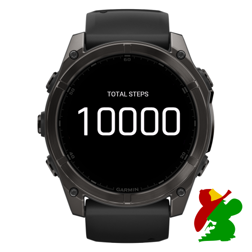

# Total Steps Data Field

Simple data field that allows you to show your total steps of the day in any activity. May be used to know when you have reached your daily step goal during an activity.

How to add a data field after the installation: https://support.garmin.com/en-US/?faq=gyywAozBuAAGlvfzvR9VZ8
https://www.youtube.com/watch?v=TXjTYmF91g0
